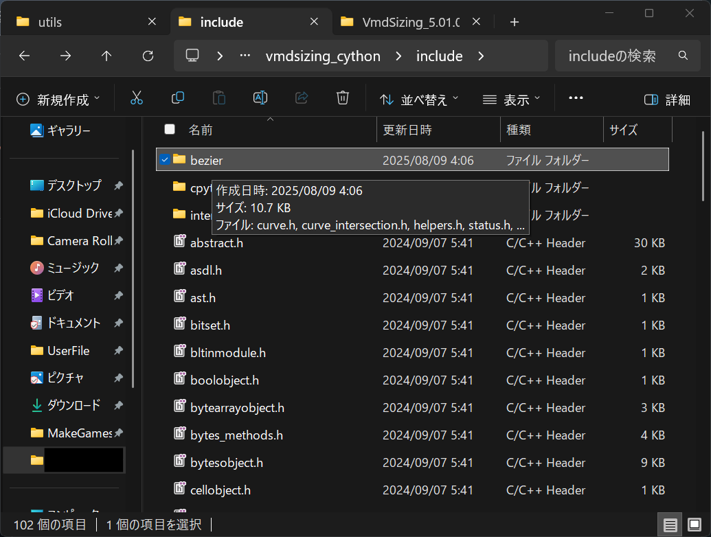

# VMDサイジング


## Dependencies

 - [numpy](https://pypi.org/project/numpy/)
 - [wxPython](https://pypi.org/project/wxPython/)
 - [numpy-quaternion](https://pypi.org/project/numpy-quaternion/)
 - [bezier](https://pypi.org/project/bezier/)

## How to build

We will use Cython based build.

### prerequisite
- conda environment (miniconda3)
- [bezier](https://github.com/dhermes/bezier/tree/2020.2.3) (for copying include folder later)

for these ones you should install them from Visual Studio Installer.
- Windows SDK
- MSVC v143 (with ATL and MFC)
- C++/CLI support for v143
- CMake tool

and make sure cl.exe is in PATH. EXAMPLE:

```
C:\Program Files\Microsoft Visual Studio\2022\Community\VC\Tools\MSVC\14.44.35207\bin\Hostx64\x64
```

### building process

1. clone repository
```
git clone https://github.com/ulyssas/vmd_sizing_english -b localization
```

2. open `Anaconda Prompt` from Start Menu and type
```
conda create -n vmdsizing_cython python=3.8
```

3. install these packages
```
pip install bezier==2020.2.3
pip install Cython==0.29.21
pip install numpy==1.19.1
pip install numpy-quaternion==2019.12.11.22.25.52
pip install pyinstaller==4.5.1
pip install wxPython==4.1.0
```

4. put bezier include folder into conda env include

It should look like this:


5. D&D `vmd_sizing_english\src\setup_install.bat` and hit enter

6. D&D `vmd_sizing_english\run_gui.bat` and hit enter